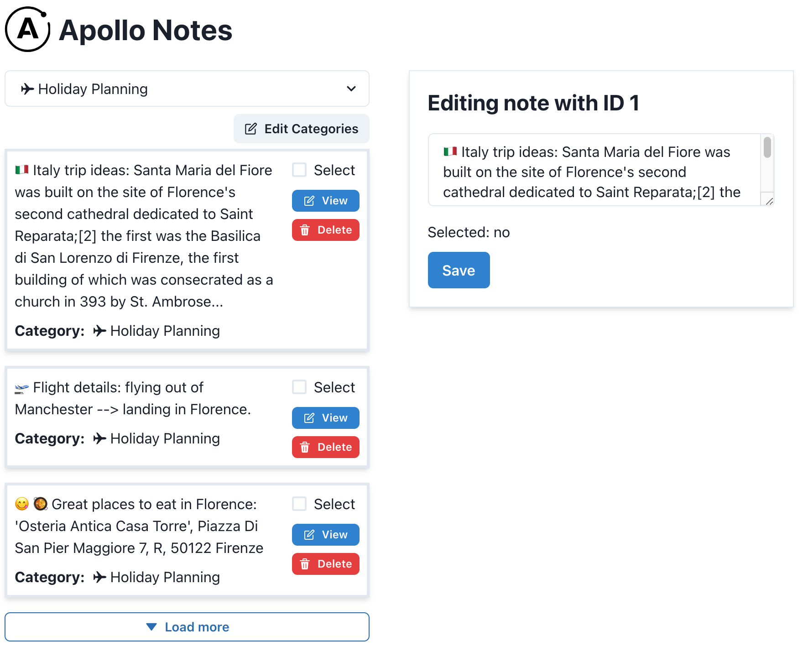

# Synchronise your client and server state in React using Apollo Client

This is the companion code (and project) for the Egghead course with the same name.

It contains the complete final solution we are building up to as well as numbered branches that correspond to individual lessons.

## Intro

Most apps we build will be backed up by a server. That's where we persist our data and coordinate all the different versions of our app
running on our clients' machines (imagine multiple users chatting with each other via a central server).

But communicating over the network is slow. Your users will want the app to feel like it is responsive to their actions.
If you request the same data twice on the client, it should re-use the previous response, without waiting on a new request.
If a component makes a request to the backend to change a specific entity, we already know on the client what we want to change
and how we want to change it, so if the server tells us the request succeeded, all other components in your app interested in that entity should instantly
re-render, without having to make a follow-up GET call.

But introducing optimisations like these can come at the risk of stale or even falsy data. If we share data between all components so that it can
be efficiently re-used, we have to make sure it's kept up to date: if a user changes their email in one place, we don't want to display their old
email in another component that is still listening to some old version of the data. Even though that second component loads super fast, it shows
wrong data, so it's not okay.

### Apollo Client

This is where GraphQL and Apollo Client can help.

Using GraphQL, we can organise the data we care about as a graph.
By making sense of it that way, we can react to changes in that graph more reliably: if a component that displays a full blog post
makes a change to that post's title, then a different component that displays a minimal list of blog post titles can react to that change and
also re-render the title of that post's title in its list. Even though they display mostly different data, they "realised" that the blog post
refers to the same entity.

And because GraphQL requests cannot natively be cached by the browser, as their shape and form change often, Apollo brings a versatile
caching layer to the client that understand this entity graph. This ensures the data is maximally shared between all components and we
only reach out to the server when necessary. It's not just a client library for making GraphQL queries and mutations.

Not only that, it also brings a lot of utilities for solving common UI requirements, such as: handling loading and error states,
pagination, websocket subscriptions, optimistic UIs with rollbacks and even transitioning to offline-first apps by syncing the cache
to local storage.

And in this course we'll be exploring how to use Apollo Client in a React app to ensure it remains responsive to user actions while avoiding
stale and falsy data.

## The example app

In this course, we'll be building a collaborative note-taking application. Users will be able to either make quick edits to a running list of notes
or explore specific notes in more detail, getting access to more specialised text editing functions.

Towards the end of the course we'll be adding a "collaborative" layer to the app, where we'll subscribe (via websocket) to updates from other users
and integrate those into our notes.

We'll be looking at how Apollo helps us to:

- easily handle loading states when grabbing notes data from the server
- store notes in the local cache so other components can retrieve them quickly
- automatically re-render notes whenever their data changes in the local cache
- optimistically update the UI whenever a user edits a note, so that it feels quick, and then sync the changes to the server in the background
- sync the cache to the browser's local storage, so that notes load instantly when the user opens the app
- and many others!

[App Mock](./note-tacking-app.png)

## Running the project

There are 2 folders: `./client` and `./server`. We will mainly work in the client, but we need the server to act as a GraphQL backend.

1. `cd server && npm install`
2. `cd client && npm install`
3. In two terminals, run `npm start` in the client and then the server folder (you can also run `npm start` in the root, which will start both)
